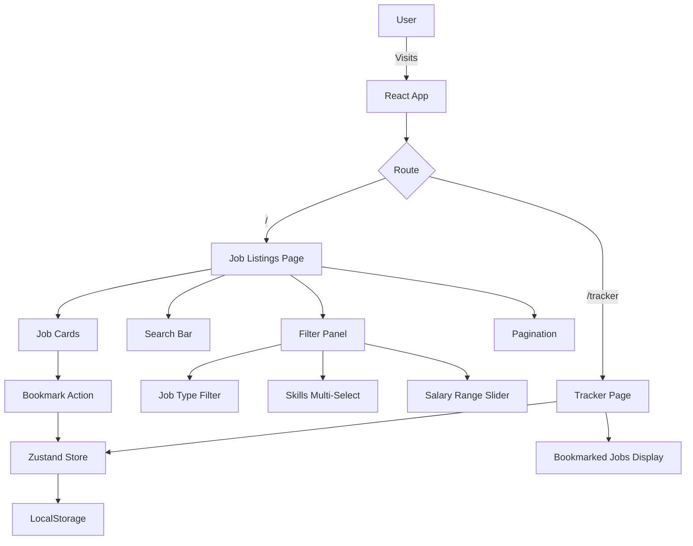
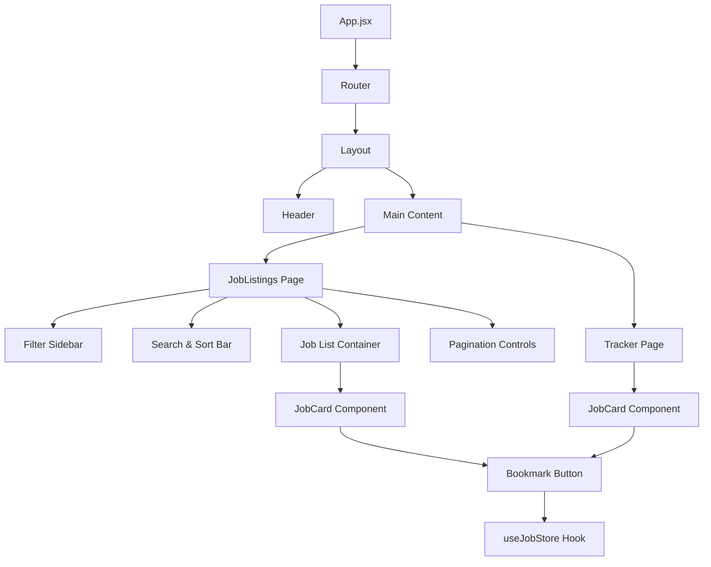
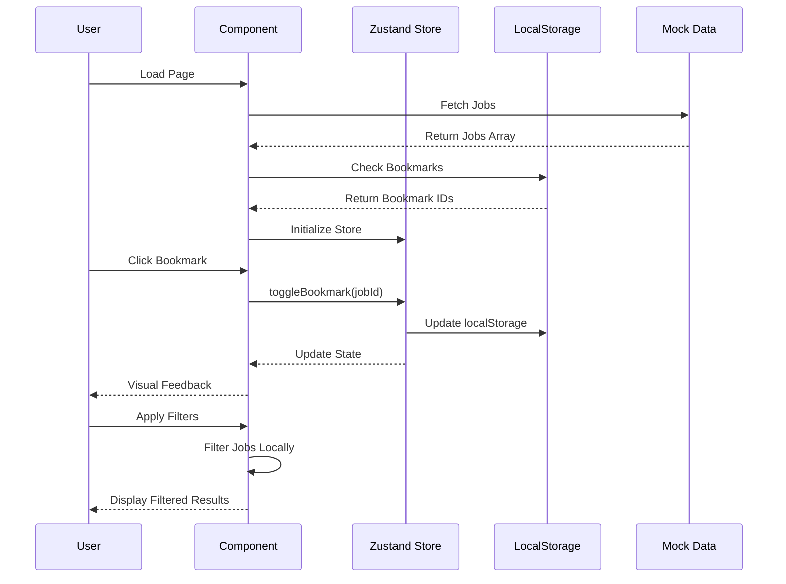
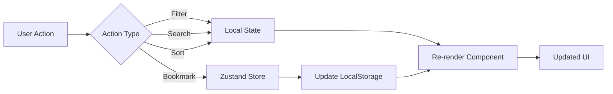
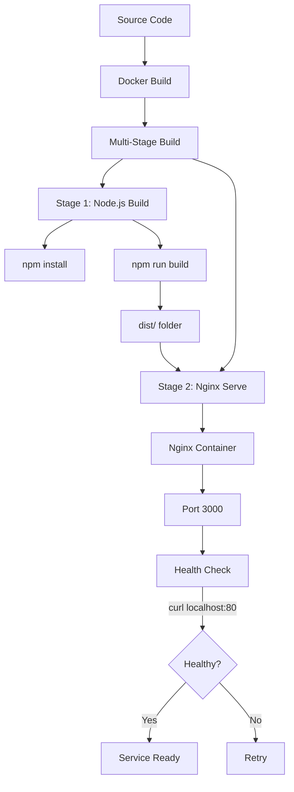

# Job Board Application 

A React-based job board application with advanced filtering, sorting, and bookmarking capabilities.

## 📋 Table of Contents

- [Requirements](#requirements)
- [Setup & Run](#setup--run)
- [Features](#features)
- [Architecture](#architecture)
- [Tech Stack](#tech-stack)
- [Project Structure](#project-structure)

## Requirements

- Docker
- Node.js (for local development)

## Setup & Run

### Using Docker (Recommended)

1.  **Build and start the application:**
    ```bash
    docker-compose up --build
    ```
2.  **Access the application:**
    Open [http://localhost:3000](http://localhost:3000) in your browser.

### Local Development

1.  **Install dependencies:**
    ```bash
    npm install --legacy-peer-deps
    ```
2.  **Start the development server:**
    ```bash
    npm run dev
    ```

## Features

- **Job Listings:** Browse jobs with infinite scroll/pagination (client-side).
- **Filtering:** Filter by Job Type, Skills, and Salary Range.
- **Search:** Instant search by title or company.
- **Sorting:** Sort by Posted Date or Salary.
- **View Modes:** Toggle between Grid and List views.
- **Bookmarking:** Locally persist bookmarked jobs.
- **Tracker:** View all bookmarked jobs in a dedicated page.

## Architecture

### Application Flow



### Component Hierarchy



### Data Flow



### State Management



### Deployment Architecture



## Tech Stack

- **React** - UI Library
- **Tailwind CSS** - Styling
- **Zustand** - State Management
- **SWR** - Data Fetching (simulation)
- **React Select** - Multi-select component
- **React Slider** - Range slider component
- **Lucide React** - Icon library
- **React Router** - Client-side routing
- **Docker & Nginx** - Containerization and deployment

## Project Structure

```
.
├── public/
│   └── job.ico                 # Favicon
├── src/
│   ├── components/
│   │   └── JobCard.jsx         # Job card component
│   ├── data/
│   │   └── mock-data.json      # Mock job data
│   ├── pages/
│   │   ├── JobListings.jsx     # Main job listings page
│   │   └── Tracker.jsx         # Bookmarked jobs page
│   ├── store/
│   │   └── useJobStore.js      # Zustand store
│   ├── utils/
│   │   └── jobUtils.js         # Utility functions
│   ├── App.jsx                 # Main app component
│   ├── main.jsx                # Entry point
│   └── index.css               # Global styles
├── Dockerfile                  # Docker configuration
├── docker-compose.yml          # Docker Compose configuration
├── tailwind.config.js          # Tailwind configuration
├── postcss.config.js           # PostCSS configuration
└── package.json                # Dependencies
```

## Key Features Implementation

### Filtering System
- **Job Type**: Radio button selection (All, Remote, Hybrid, Onsite)
- **Skills**: Multi-select dropdown with AND logic (jobs must have ALL selected skills)
- **Salary Range**: Dual-handle slider ($0k - $200k+)

### Bookmark Persistence
- Uses Zustand for state management
- Syncs with `localStorage` under key `bookmarkedJobs`
- Format: JSON array of job IDs `[1, 3, 5]`

### Pagination
- Client-side pagination (10 items per page)
- Next/Previous controls
- Auto-reset to page 1 on filter changes

### View Modes
- **Grid View**: Card-based layout (responsive columns)
- **List View**: Row-based layout with horizontal alignment
